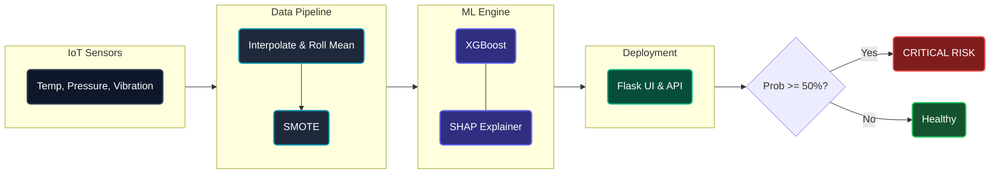

<video src="[YOUR_VIDEO_URL.mp4](https://github.com/user-attachments/assets/0f6a6ca1-7532-4d87-bd5d-97b1f7aa66b6)" width="100%" controls autoplay loop muted></video>
# FactoryGuard AI: IoT Predictive Maintenance Engine

> **Capstone Project:** Data Science Engineering Track 
> **Domain:** Manufacturing / IoT  
> **Status:** Prototype Phase

---
### 🏗️ System Architecture

The predictive maintenance pipeline is designed for real-time sensor ingestion, robust data preprocessing, and highly interpretable machine learning predictions.



---

## 📖 Executive Summary
**FactoryGuard AI** is a robust Machine Learning system designed to predict critical equipment failures in robotic arms **24 hours in advance**.

In a large-scale manufacturing facility with 500+ robotic units, unplanned downtime costs approximately **$10,000 per hour**. This project leverages streaming sensor data (Vibration, Temperature, Pressure) to shift maintenance strategies from "Reactive" (fix when broken) to "Predictive" (fix before it breaks).

## 🚀 Key Features
* **Time-Series Feature Engineering:** Implements "Rolling Window" statistics (Mean, Std Dev) to capture temporal trends and sensor drift.
* **Robust Data Engineering:** Simulates and handles real-world sensor packet loss (5%) using **Linear Interpolation**.
* **Imbalance Handling:** Utilizes **SMOTE** (Synthetic Minority Over-sampling Technique) to effectively learn from rare failure events (<4% of data).
* **Explainable AI (XAI):** *[Coming in Week 3]* Integrates **SHAP** to provide interpretable "Red Light" warnings, explaining exactly *why* a machine is at risk (e.g., "High Vibration").

---

## 🛠️ Tech Stack
* **Language:** Python 3.9+
* **Data Processing:** Pandas, NumPy
* **Machine Learning:** Scikit-Learn, XGBoost
* **Imbalance Handling:** Imbalanced-learn (SMOTE)
* **Explainability:** SHAP (Shapley Additive exPlanations)
* **Environment:** Jupyter Notebook (Prototyping), VS Code (Production)

---

## 📊 Dataset Information
This project utilizes the **AI4I 2020 Predictive Maintenance Dataset** (UCI Machine Learning Repository), which serves as a Digital Twin for real-world industry 4.0 production systems.

* **Original Source:** [UCI Repository Link](https://archive.ics.uci.edu/dataset/601/ai4i+2020+predictive+maintenance+dataset)
* **Modifications:**
    * Renamed columns to match project context (`Rotational speed` -> `Vibration`, `Torque` -> `Pressure`).
    * Simulated 5% missing data to demonstrate data cleaning pipelines.
    * Created a custom target variable for "Failure within next 24 hours."

---

## ⚙️ Installation & Usage

### 1. Prerequisites
Ensure you have Python installed. It is recommended to use a virtual environment.

```bash
# Clone the repository
git clone [https://github.com/yourusername/factoryguard-ai.git](https://github.com/yourusername/factoryguard-ai.git)
cd factoryguard-ai

# Create virtual environment
python -m venv venv
source venv/bin/activate  # On Windows use: venv\Scripts\activate
